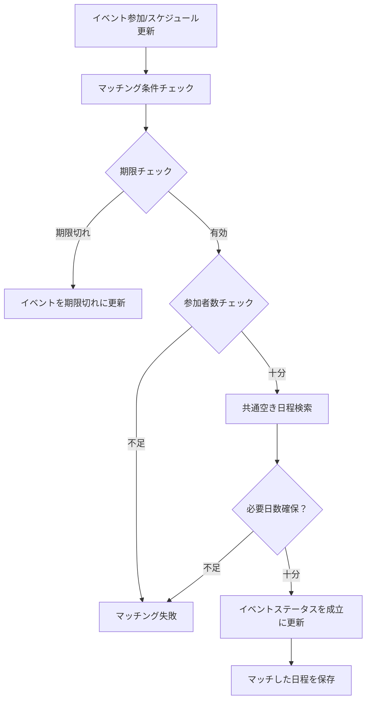

# スケジュール調整サービス アーキテクチャドキュメント

## 概要

このプロジェクトは、複数のユーザーが参加するイベントの日程調整を自動化するWebサービスです。参加者が空き時間を登録すると、自動的にマッチングが実行され、条件を満たした場合にイベントが成立します。

## システム仕様

### 機能概要

1. **ユーザー認証**
   - JWT認証による安全なアクセス制御
   - ユーザー登録・ログイン機能

2. **イベント管理**
   - イベント作成・編集・削除
   - 必要参加者数と必要日数の指定
   - 参加締切の設定（オプション）

3. **スケジュール管理**
   - 時間帯別空き時間登録（午前・午後・終日）
   - 複数日程の一括登録
   - 個人スケジュールの管理

4. **自動マッチング機能**
   - リアルタイム自動マッチング実行
   - 参加者の共通空き日程の検索
   - イベントステータスの自動更新

5. **UI・UX**
   - イベント状況の視覚的区別
   - 成立済みイベントの詳細表示
   - マッチング状況のリアルタイム表示

## アーキテクチャ

### システム構成

```
├── Frontend (Next.js 15 + React)
├── API Layer (Next.js App Router)
├── Business Logic Layer
├── Data Access Layer
└── Database (SQLite + better-sqlite3)
```

### 技術スタック

| 分野 | 技術 |
|------|------|
| **フレームワーク** | Next.js 15 (App Router) |
| **ランタイム** | Node.js 22+ |
| **言語** | TypeScript |
| **データベース** | SQLite with better-sqlite3 |
| **認証** | JWT (jsonwebtoken) |
| **パスワード** | bcryptjs |
| **スタイリング** | Tailwind CSS |
| **テスト** | Vitest |
| **開発** | Turbopack |

### ディレクトリ構造

```
src/
├── app/                          # Next.js App Router
│   ├── api/                      # API エンドポイント
│   │   ├── auth/                 # 認証関連API
│   │   ├── events/               # イベント管理API
│   │   ├── schedules/            # スケジュール管理API
│   │   └── matching/             # マッチング情報API
│   ├── auth/                     # 認証ページ
│   ├── dashboard/                # ダッシュボード
│   └── globals.css               # グローバルスタイル
├── components/                   # React コンポーネント
│   ├── auth/                     # 認証コンポーネント
│   ├── events/                   # イベント関連コンポーネント
│   ├── matching/                 # マッチング関連コンポーネント
│   └── schedules/                # スケジュール関連コンポーネント
├── contexts/                     # React Context
│   └── AuthContext.tsx           # 認証状態管理
├── lib/                          # ビジネスロジック
│   ├── __tests__/                # ユニットテスト
│   ├── auth.ts                   # 認証ロジック
│   ├── database.ts               # データベース接続
│   ├── eventStorage.ts           # イベントデータアクセス
│   ├── matchingEngine.ts         # マッチングエンジン
│   ├── scheduleStorage.ts        # スケジュールデータアクセス
│   └── userStorage.ts            # ユーザーデータアクセス
└── types/                        # TypeScript型定義
    ├── event.ts
    ├── schedule.ts
    └── user.ts
```

## データベース設計

### ERD概要

```
Users (1) --< (M) EventParticipants (M) >-- (1) Events
                                                  |
                                                  |
Users (1) --< (M) Schedules                      |
                                                  |
                                            MatchedDates
```

### テーブル定義

#### Users
| カラム | 型 | 制約 | 説明 |
|--------|----|----- |------|
| id | TEXT | PRIMARY KEY | ユーザーID |
| password | TEXT | NOT NULL | ハッシュ化パスワード |
| created_at | DATETIME | DEFAULT CURRENT_TIMESTAMP | 作成日時 |
| updated_at | DATETIME | DEFAULT CURRENT_TIMESTAMP | 更新日時 |

#### Events
| カラム | 型 | 制約 | 説明 |
|--------|----|----- |------|
| id | TEXT | PRIMARY KEY | イベントID |
| name | TEXT | NOT NULL | イベント名 |
| description | TEXT |  | 説明 |
| required_participants | INTEGER | NOT NULL | 必要参加者数 |
| required_days | INTEGER | NOT NULL | 必要日数 |
| creator_id | TEXT | FOREIGN KEY | 作成者ID |
| status | TEXT | CHECK | イベントステータス |
| matched_dates | TEXT |  | マッチした日程（JSON） |
| deadline | DATETIME |  | 参加締切 |
| created_at | DATETIME | DEFAULT CURRENT_TIMESTAMP | 作成日時 |
| updated_at | DATETIME | DEFAULT CURRENT_TIMESTAMP | 更新日時 |

#### EventParticipants
| カラム | 型 | 制約 | 説明 |
|--------|----|----- |------|
| event_id | TEXT | FOREIGN KEY | イベントID |
| user_id | TEXT | FOREIGN KEY | ユーザーID |
| joined_at | DATETIME | DEFAULT CURRENT_TIMESTAMP | 参加日時 |

#### Schedules
| カラム | 型 | 制約 | 説明 |
|--------|----|----- |------|
| id | TEXT | PRIMARY KEY | スケジュールID |
| user_id | TEXT | FOREIGN KEY | ユーザーID |
| date | DATE | NOT NULL | 対象日 |
| morning | BOOLEAN | DEFAULT FALSE | 午前の空き |
| afternoon | BOOLEAN | DEFAULT FALSE | 午後の空き |
| fullday | BOOLEAN | DEFAULT FALSE | 終日の空き |
| created_at | DATETIME | DEFAULT CURRENT_TIMESTAMP | 作成日時 |
| updated_at | DATETIME | DEFAULT CURRENT_TIMESTAMP | 更新日時 |

### インデックス設計

- `events.creator_id` - 作成者でのイベント検索
- `events.status` - ステータス別イベント検索
- `event_participants.event_id` - イベント参加者検索
- `event_participants.user_id` - ユーザー参加イベント検索
- `schedules.user_id` - ユーザースケジュール検索
- `schedules.date` - 日付でのスケジュール検索

## API設計

### 認証 (`/api/auth`)

| エンドポイント | メソッド | 説明 |
|---------------|---------|------|
| `/register` | POST | ユーザー登録 |
| `/login` | POST | ログイン |
| `/verify` | GET | トークン検証 |

### イベント (`/api/events`)

| エンドポイント | メソッド | 説明 |
|---------------|---------|------|
| `/` | GET | イベント一覧取得 |
| `/` | POST | イベント作成 |
| `/[id]` | GET | イベント詳細取得 |
| `/[id]` | PUT | イベント更新 |
| `/[id]` | DELETE | イベント削除 |
| `/[id]/join` | POST | イベント参加 |
| `/[id]/join` | DELETE | イベント退会 |

### スケジュール (`/api/schedules`)

| エンドポイント | メソッド | 説明 |
|---------------|---------|------|
| `/availability` | POST | 空き時間一括登録 |
| `/availability` | GET | 空き時間取得 |

### マッチング (`/api/matching`)

| エンドポイント | メソッド | 説明 |
|---------------|---------|------|
| `/` | GET | マッチング統計情報 |

## 自動マッチング仕様

### マッチング条件

1. **参加者数条件**: `参加者数 >= 必要参加者数`
2. **日程条件**: `共通空き日程 >= 必要日数`
3. **期限条件**: `現在日時 <= 参加締切`（設定されている場合）

### マッチング実行タイミング

1. **ユーザーがイベントに参加した時**
   - `POST /api/events/[id]/join` 実行時
   - `matchingEngine.onParticipantAdded()` が自動実行

2. **ユーザーがスケジュールを更新した時**
   - `POST /api/schedules/availability` 実行時
   - `matchingEngine.onScheduleUpdated()` が自動実行

3. **定期的なバッチ処理**（実装可能）
   - `matchingEngine.checkAllEvents()` で全イベントをチェック

### マッチング処理フロー



## セキュリティ

### 認証・認可

- **JWT認証**: 7日間有効なアクセストークン
- **bcryptjs**: salt rounds 10でのパスワードハッシュ化
- **Bearer Token**: すべてのAPI呼び出しで認証必須
- **CORS対応**: Next.js内蔵のCORS設定

### データ保護

- **SQLiteトランザクション**: データ整合性の保証
- **SQLインジェクション対策**: prepared statementの使用
- **XSS対策**: React標準のエスケープ機能

## テスト戦略

### テストピラミッド

```
        E2E Tests (Future)
    ┌─────────────────────┐
    │   Integration Tests │  ← API統合テスト
    │   ┌─────────────┐   │
    │   │ Unit Tests  │   │  ← ロジックテスト
    │   └─────────────┘   │
    └─────────────────────┘
```

### 現在のテストカバレッジ

1. **ユニットテスト** (`src/lib/__tests__/`)
   - `matchingEngine.test.ts`: マッチングロジック (16テスト)
   - 各ストレージクラスのテスト

2. **API統合テスト** (`src/app/api/__tests__/`)
   - `events-join-integration.test.ts`: イベント参加フロー (3テスト)

### テスト実行

```bash
# 全テスト実行
yarn test

# 特定テスト実行
yarn test src/lib/__tests__/matchingEngine.test.ts
yarn test src/app/api/__tests__/events-join-integration.test.ts
```

## パフォーマンス

### 最適化施策

1. **データベース最適化**
   - 適切なインデックス設計
   - WALモードによる読み込み性能向上
   - トランザクション範囲の最小化

2. **フロントエンド最適化**
   - Turbopackによる高速ビルド
   - React Server Componentsの活用
   - 適切なuseCallbackとuseMemoの使用

3. **マッチング処理最適化**
   - 必要時のみのマッチング実行
   - 効率的な日程検索アルゴリズム

## 改善点・今後の展望

### 短期的改善点（Priority: High）

1. **エラーハンドリングの強化**
   ```typescript
   // 現在：基本的なエラーハンドリング
   catch (error) {
     console.error('Error:', error);
     return NextResponse.json({ error: 'Internal server error' }, { status: 500 });
   }

   // 改善：詳細なエラー分類と適切なレスポンス
   catch (error) {
     if (error instanceof ValidationError) {
       return NextResponse.json({ error: error.message }, { status: 400 });
     }
     if (error instanceof NotFoundError) {
       return NextResponse.json({ error: 'Resource not found' }, { status: 404 });
     }
     logger.error('Unexpected error:', error);
     return NextResponse.json({ error: 'Internal server error' }, { status: 500 });
   }
   ```

2. **入力値検証の強化**
   - Zod等のスキーマ検証ライブラリ導入
   - フロントエンド・バックエンド両方での検証

3. **ログ機能の追加**
   - 構造化ログ（JSON形式）
   - パフォーマンス監視
   - エラー追跡

### 中期的改善点（Priority: Medium）

1. **通知機能**
   ```typescript
   // イベント成立時の通知
   interface NotificationService {
     sendEventMatched(eventId: string, participants: string[]): Promise<void>;
     sendEventExpired(eventId: string, participants: string[]): Promise<void>;
   }
   ```

2. **リアルタイム更新**
   - WebSocketまたはServer-Sent Eventsによるリアルタイム通知
   - イベント状況の即座な反映

3. **データベース移行準備**
   ```typescript
   // PostgreSQL移行のための抽象化
   interface DatabaseAdapter {
     connect(): Promise<void>;
     execute(query: string, params: any[]): Promise<any>;
     transaction<T>(callback: () => Promise<T>): Promise<T>;
   }
   ```

4. **キャッシュ戦略**
   - Redis導入による高速化
   - マッチング結果のキャッシュ

### 長期的改善点（Priority: Low）

1. **スケーラビリティ対応**
   - マイクロサービス化
   - 負荷分散対応
   - レプリケーション対応

2. **高度なマッチング機能**
   ```typescript
   // 優先度付きマッチング
   interface AdvancedMatchingOptions {
     priorityWeights: {
       timePreference: number;
       userPreference: number;
       locationPreference: number;
     };
     constraints: MatchingConstraint[];
   }
   ```

3. **AI機能**
   - 参加者の過去データからの最適日程提案
   - 参加率予測による定員調整

4. **モバイルアプリ対応**
   - React Native での専用アプリ
   - プッシュ通知機能

### セキュリティ強化

1. **認証機能の拡張**
   ```typescript
   // OAuth2対応
   interface OAuth2Provider {
     google: OAuthConfig;
     github: OAuthConfig;
     microsoft: OAuthConfig;
   }

   // 多要素認証
   interface MFAService {
     generateTOTP(userId: string): Promise<string>;
     verifyTOTP(userId: string, token: string): Promise<boolean>;
   }
   ```

2. **API セキュリティ**
   - Rate limiting の実装
   - API Key 管理
   - RBAC（Role-Based Access Control）

3. **データ保護**
   - 個人情報の暗号化
   - GDPR対応
   - データ保持ポリシー

### 運用・監視

1. **監視システム**
   ```typescript
   // メトリクス収集
   interface MetricsCollector {
     recordMatchingDuration(duration: number): void;
     recordAPIResponse(endpoint: string, status: number, duration: number): void;
     recordEventCreation(): void;
   }
   ```

2. **ヘルスチェック**
   - データベース接続状況
   - 外部サービス依存状況
   - システムリソース使用状況

3. **デプロイメント**
   - CI/CD パイプライン
   - Blue-Green デプロイメント
   - 自動ロールバック機能

## まとめ

本システムは、Next.js 15とSQLiteを基盤とした効率的なスケジュール調整サービスとして設計されています。自動マッチング機能により、手動での日程調整作業を大幅に削減し、ユーザー体験を向上させています。

現在の実装は機能的に完成していますが、上記の改善点を段階的に実装することで、よりスケーラブルで堅牢なシステムに発展させることができます。特に、エラーハンドリングの強化と入力値検証の改善は、システムの信頼性向上に直結するため、優先的に取り組むべき項目です。